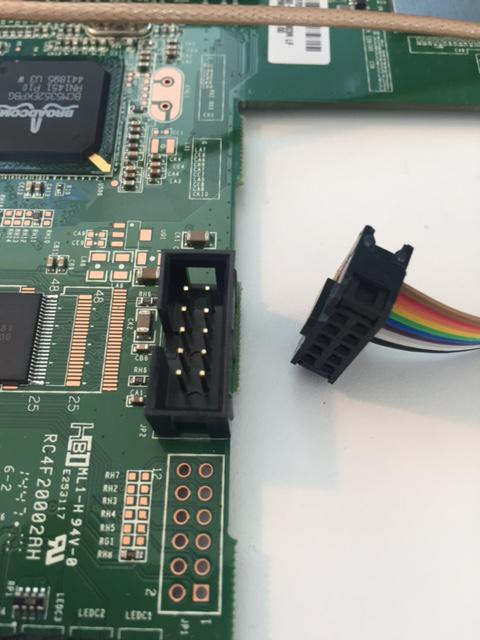
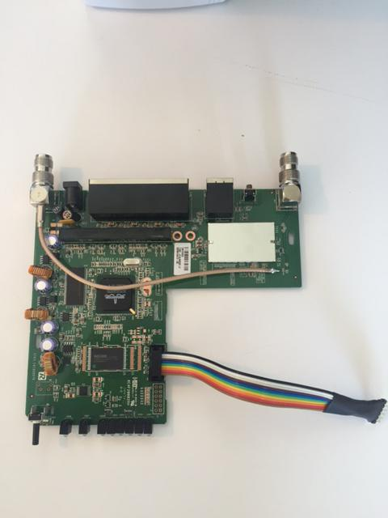
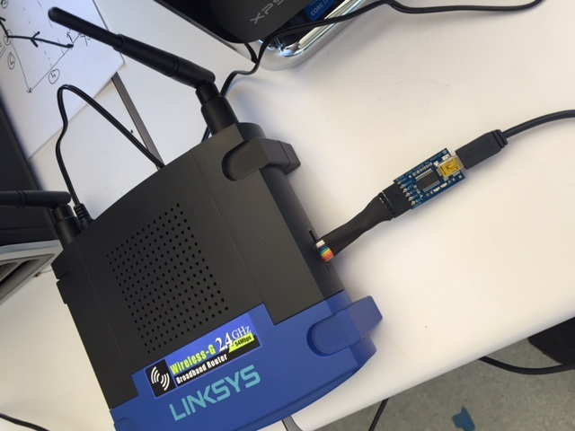

#WRT54GL
####July 2015 - I've been playing with a new [WRT54GL router](http://www.amazon.com/Linksys-WRT54GL-Wireless-G-Broadband-Router/dp/B000BTL0OA/ref=sr_1_1?s=electronics&ie=UTF8&qid=1436047039&sr=1-1&keywords=wrt54gl) for about a month and wanted to go back and make a list of the configuration lessons learned I've tracked down.  My primary references are this [book](http://www.amazon.com/Linksys-WRT54G-Ultimate-Hacking-Asadoorian/dp/1597491667/ref=sr_1_1?s=books&ie=UTF8&qid=1436045407&sr=1-1&keywords=wrt54g), and the OpenWrt [website](openwrt.org).  My examples are applicable with Mac OS X on the development machine.

##The basics
1. **Logging in** - The first thing I had to do was configure my computer to log into  the Linksys router.  The default IP on the router is 192.168.1.1. so I had to give my computer a manual IP on the same subnet. I chose 192.168.1.54.  In the systems preferences panel I selected to use "DHCP with manual IP".  With that completed just plug into any LAN port on the router and load the router address in a browser to get to the web interface.
2. **Wireless while connected directly** - Next I wanted to be able to browse the web while I'm working on this so I enabled my wifi card on my host Mac-Mini to link into the home wireless network.  The problem came up that whenever I was connected to both the WRT via ethernet and the wifi network I couldn't get web traffic to route to the wifi.  So again, open up network preferences and in the bottom left hit the little gear.  In there you can "Set Service Order.."  By dragging the wifi interface higher in the list it pushed traffic toward that interface first.
3. **Upgrading to third party firmware** - 
4. **Reverting back to original firmware** - 

##Brick on Day 1
1. THE TRUTH...I screwed up my router the first day I played around with it. I got off the reservation and started messing around with the way the router was configured to my home network...at which point I managed to shut down the wireless and DHCP server and erased it's self-assigned IP. So I could not communicate with the router anymore. **THUS...I BRICKED IT ON THE FIRST DAY!**
2. So without the ability to communicate with my new router via any available interface I went to bed pissed off and woke up early to ponder the problem over a fresh cup of coffee.  My solution was to find a way to connect to the serial console provided on the PCB inside the router so I could directly control the linux processor.
3. There is a good discussion in chapter 7 of the book on building a serial cable to get access to the console via JP2 on the PCB.  The book version requires a level shifting IC to convert the signal level on the board to RS-232 power levels.  Then it connects this to an RS-232 serial connector.  I certainly don't have an RS-232 port on my Mac-Mini or my Macbook Air, so I need to use USB.
4. Using the book to understand the pin-out of JP2 on the PCB, I used an Adafruit [FTDI Friend](https://www.adafruit.com/products/284) to convert the serial signal to USB as follows: 
5. *Voltage mod* - The WRT54GL operates with 3.3V on the PCB, not 5V which is the default VCC Out on the FTDI Friend.  So you will need to cut the 5V trace and solder across the 3.3V jumper.
6. *Connector bill of materials* - Next we need to build the cable to plug into the FTDI Friend.  I get most of my hobby level stuff from [Sparkfun](sparkfun.com):
	* a. [2x5 pin male connector](https://www.sparkfun.com/products/8506)
	* b. [2x5 pin female crimp connector](https://www.sparkfun.com/products/10650)
	* c. [10 wire ribbon cable](https://www.sparkfun.com/products/10647)
	* d. [male headers](https://www.sparkfun.com/products/116)
	* e. [heat shrink](https://www.sparkfun.com/search/products?term=heat+shrink)
7. *Assemble the cable* - Solder the male connector to the PCB.  Then crimp the female ribbon wire onto the female connector.  Then break off a piece of the male headers that is 6 pins wide.  Cut off about 8 inches of ribbon cable then very carefully figure out which pins on the connector line up with the pin-out on the FTDI Friend.  You will need to make sure that these pins all line up
GND, VCC, TX, and RX.  The remaining six wires in the connector can be cut short and left disconnected from the male headers strip.  Once everything is soldered use some heat shrink to protect and strengthen the connection to the headers stip.  Some photos of my cable are included below:

8. The FTDI Friend will also require a micro-USB cable to plug into the mac.
9. Once everything is soldered up, connected and reassembled, power the router up with the cable plugged in.  The FTDI will make the serial terminal from the router appear in the `/dev/` directory as something like `tty.usbserial-XXXXX`.  Use the `screen` utility to monitor the terminal.  From the book we know that the baud rate for the WRT54GL console is 115200 so this command will give access to the console, `screen <tty.usbserial-XXXX> 115200`.  Of course you will have to put the right file handle in.  I've written a script, `/bin/wrt_console.sh` that will search the `/dev/` folder and open the console.